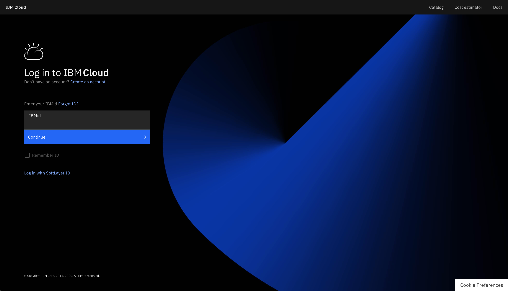
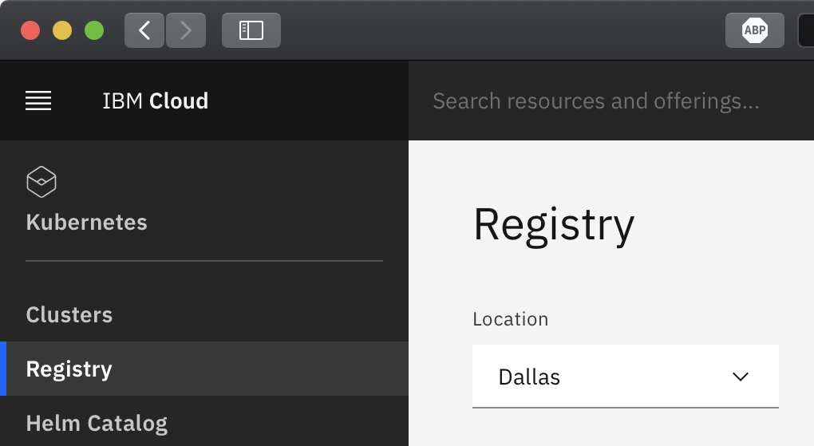
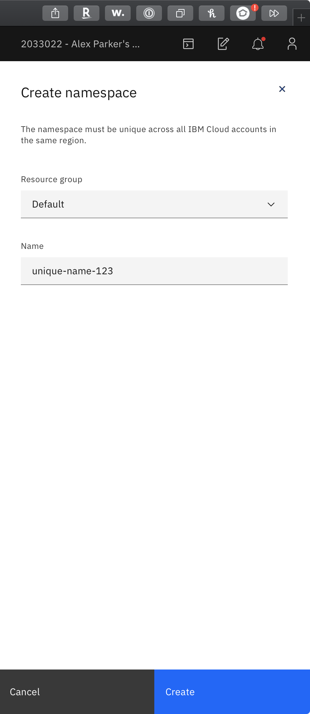

# Creating an IBM Cloud Container Registry Namespace

## Objectives
In this lab, you will:
- Sign up for an IBM Cloud account
- View the IBM Cloud catalog
- View the IBM Cloud Container Registry service
- Create a Container Registry namespace

## Lab Overview
IBM Cloud offers numerous cloud resources and services. In this hands-on lab, you will create a Lite account on IBM Cloud. You can subsequently use your IBM Cloud Lite account, in this course or otherwise, to explore the catalog and provision many cloud services at no charge.

## About IBM Cloud
The IBM Cloud platform globally deployed across data centers around the world, combines platform as a service (PaaS) with infrastructure as a service (IaaS) to provide an integrated experience. The platform scales and supports both small development teams and organizations, and large enterprise businesses.

The platform is built to support your needs whether it's working only in the public cloud or taking advantage of a multicloud deployment model. IBM Cloud offers a variety of services including Compute, Network, Storage, Management, Security, Databases, Analytics, AI and Cloud Paks.

# Create an IBM Cloud account
1. Go to [create a free account on IBM Cloud](https://cloud.ibm.com/registration?target=%2Fkubernetes%2Fregistry%2Fmain%2Fstart).

2. Follow the steps to create your account. This will involve providing your email address and password, as well as some personal information. You'll have to verify your account by accessing your email too.

3. Once you have created an account, go to the [IBM Cloud login page](https://cloud.ibm.com/login) and log in to your account.

Congratulations! You can now explore the [IBM Cloud catalog](https://cloud.ibm.com/catalog) and provision various services.

# Create a Container Registry namespace
1. Click the "Catalog" button in the top navigation to go to the [IBM Cloud catalog](https://cloud.ibm.com/catalog).

2. In the "Search the catalog…" box, type "Container Registry" and hit "Enter" on your keyboard to search.

3. Click on the "Container Registry" tile in the search results.

4. You can now read about the Container Registry service and visit links for API documentation and docs about how to use the service.

5. Click "Create" on the right side.

6. Ensure that the location is set to "Dallas."

7. Click on the "Namespaces" menu item.

8. Click "Create" on the right side in order to create a namespace.

9. Choose the resource group you would like this namespace to reside in. "Default" is a fine option.

10. Give the namespace a unique name. This name must be unique across all users of the Container Registry service in this region.

11. Click "Create" at the bottom right to create the namespace.
Now you have a namespace to which you can push images. Since IBM Cloud Container Registry is a multi-tenant registry in the public cloud, namespaces are used to provide isolation for users' images. The namespace is a slice of the registry to which you can push your images. The namespace will be a part of the image name when you tag and push the image. For example, `us.icr.io/<my_namespace>/<my_repo>:<my_tag>`. You will use this namespace in the lab for the next module.

Congratulations! You have completed this lab.
