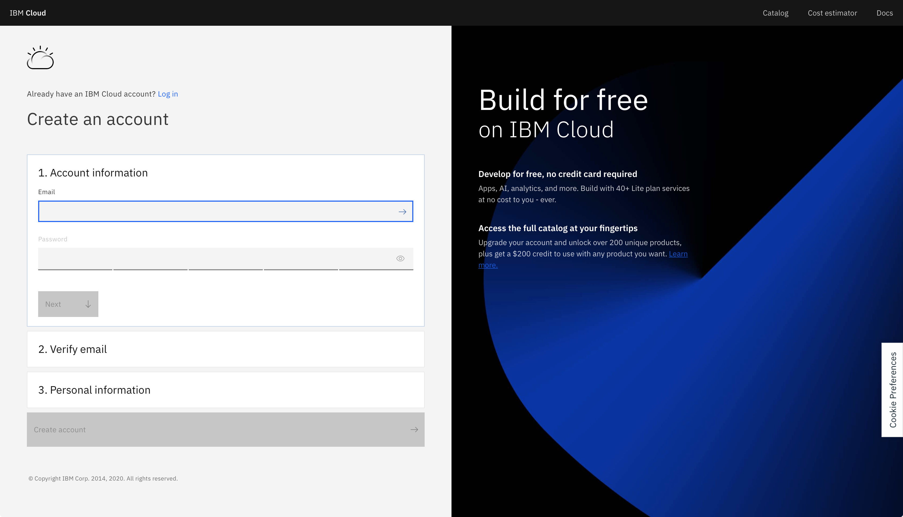
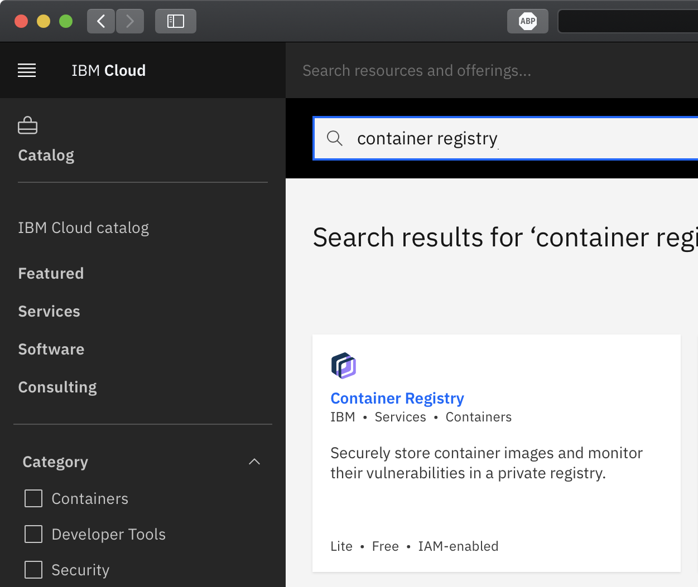
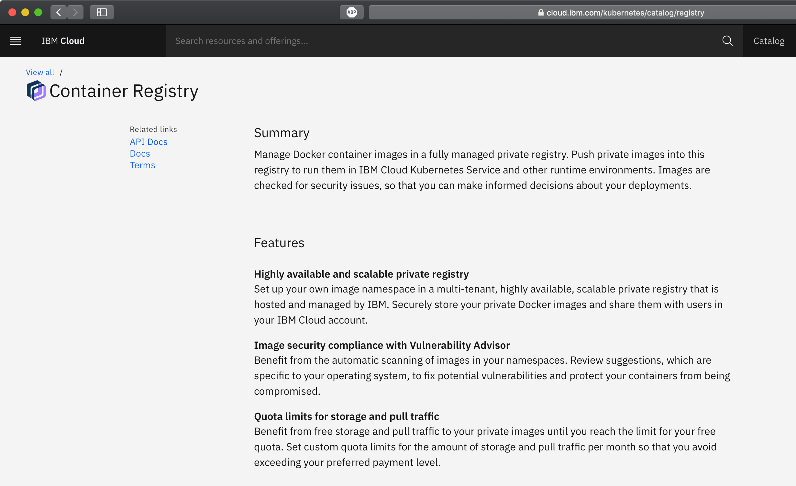
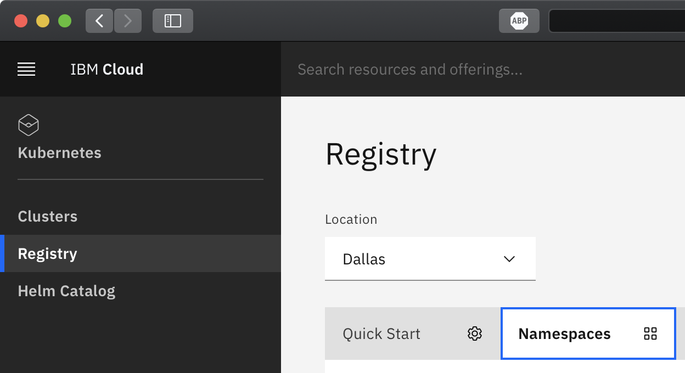

# Creating an IBM Cloud Container Registry Namespace

## Objectives
In this lab, you will:
- Sign up for an IBM Cloud account
- View the IBM Cloud catalog
- View the IBM Cloud Container Registry service
- Create a Container Registry namespace

## Lab Overview
IBM Cloud offers numerous cloud resources and services. In this hands-on lab, you will create a Lite account on IBM Cloud. You can then use your IBM Cloud Lite account, in this course or otherwise, to explore the catalog and provision many cloud services at no charge. In this lab you will also create an IBM Cloud Container Registry namespace, which you will use in a subsequent lab.

## About IBM Cloud
The IBM Cloud platform is deployed across data centers around the world. It combines platform as a service (PaaS) with infrastructure as a service (IaaS) to provide an integrated experience. The platform scales and supports both large enterprise businesses and small development teams and organizations.

The platform is built to support your needs, whether it's working only in the public cloud or taking advantage of a multicloud deployment model. IBM Cloud offers a variety of services, including Compute, Network, Storage, Management, Security, Databases, Analytics, AI, and Cloud Paks.

## About IBM Cloud Container Registry namespaces
IBM Cloud Container Registry is a multi-tenant registry in the public cloud. Namespaces are used to provide isolation for users' images. The namespace is a slice of the registry to which you can push your images. The namespace will be a part of the image name when you tag and push an image. For example, `us.icr.io/<my_namespace>/<my_repo>:<my_tag>`.

# Create an IBM Cloud account
1. Go to [IBM Cloud sign-up page](https://cloud.ibm.com/registration?target=%2Fkubernetes%2Fregistry%2Fmain%2Fstart).

2. Follow the steps to create your account. You will need to provide an email address and password, as well as some personal information. You'll have to verify your account by accessing your email.  
{ width=840 height=482 }

3. Once you have created an account, go to the [IBM Cloud login page](https://cloud.ibm.com/login) and log in to your account.  
{ width=840 height=482 }

Congratulations! You can now explore the [IBM Cloud catalog](https://cloud.ibm.com/catalog) and provision various services.

# Create a Container Registry namespace
1. Click the **Catalog** button in the top navigation to go to the [IBM Cloud catalog](https://cloud.ibm.com/catalog).

2. In the **Search the catalog…** box, type <code>Container Registry</code> and press Enter on your keyboard.

3. Click the **Container Registry** tile in the search results.  
{ width=626 height=527 }

4. You can now read about the Container Registry service and visit links for API documentation and docs about how to use the service.  
{ width=615 height=376 }

5. At the top right, click **Create**.

6. Ensure that the location is set to **Dallas**.  
{ width=510 height=280 }

7. Click the **Namespaces** tab.  
{ width=624 height=340 }

8. On the right side of the Namespaces panel, click **Create**. A **Create namespace** panel opens.

9. In the **Resource group** field, select the name of the resource group you would like this namespace to reside in. For this lab, you can simply leave the selection as **default**.

10. In the **Name** field, type a unique name for the namespace. The name must be unique across all users of the Container Registry service in this region.  
{ width=223 height=514 }

11. Click **Create** at the bottom of the panel to create the namespace.

You now have a namespace to which you can push images.

Congratulations! You have completed the second lab for the first module of this course.
