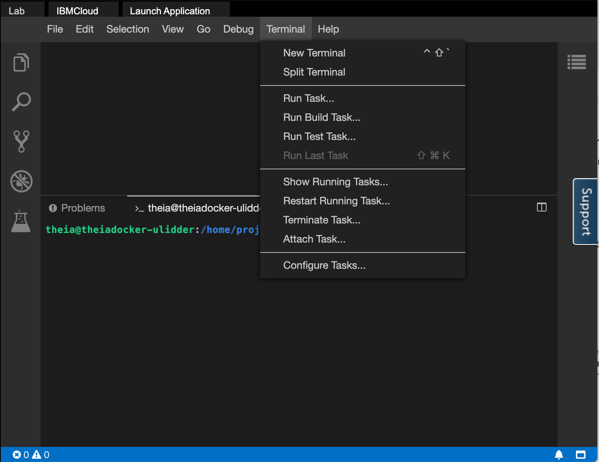

# Introduction to Kubernetes

## Objectives
In this lab, you will:
- Use the `kubectl` CLI
- Create a Kubernetes Pod
- Create a Kubernetes Deployment
- Create a ReplicaSet that maintains a set number of replicas

# Verify the environment and command line tools
1. If a terminal is not already open, open a terminal window by using the menu in the editor: `Terminal > New Terminal`.


2. Verify that `kubectl` CLI is installed.
```
kubectl version
```
You should see output similar to this, though the versions may be different.
```
Client Version: version.Info{Major:"1", Minor:"17", GitVersion:"v1.17.2", GitCommit:"59603c6e503c87169aea6106f57b9f242f64df89", G
itTreeState:"clean", BuildDate:"2020-01-18T23:30:10Z", GoVersion:"go1.13.5", Compiler:"gc", Platform:"linux/amd64"}
Server Version: version.Info{Major:"1", Minor:"16", GitVersion:"v1.16.10+IKS", GitCommit:"a0052bd119c067cf48e8a19f0ab7d5a5e2ca0a1
8", GitTreeState:"clean", BuildDate:"2020-05-20T20:48:06Z", GoVersion:"go1.13.9", Compiler:"gc", Platform:"linux/amd64"}
```

3. Change directories to your home folder.
```
cd
```

4. Clone the git repository that contains the artifacts needed for this lab, if it doesn't already exist.
```
[ ! -d 'cc201' ] && git clone https://gitlab.com/ibm/skills-network/courses/cc201.git
```

5. Change to the directory for this second lab.
```
cd cc201/labs/Introduction\ to\ Kubernetes/
```

6. List the contents of this directory to see the artifacts for this lab.
```
ls
```

# Use the `kubectl` CLI
Recall that Kubernetes namespaces allow you to virtualize a cluster. You already have access to one namespace in a Kubernetes cluster, and `kubectl` is already set to target that cluster and namespace.

Let's look at some basic `kubectl` commands.

1. `kubectl` requires configuration so that it targets the appropriate cluster. Get cluster information with the following command:
```
kubectl config get-clusters
```

2. A `kubectl` context is a group of access parameters, including a cluster, a user, and a namespace. View your current context with this command:
```
kubectl config get-contexts
```

3. List all the Pods in your namespace. If this is a new session for you, you will not see any Pods.
```
kubectl get pods
```

# Create a Pod with an imperative command
Now it's time to create your first Pod. This Pod will run the `hello-world` image you built and pushed to IBM Cloud Container Registry in the last lab. As explained in the videos for this module, you can create a Pod imperatively or declaratively. Let's do it imperatively first.

1. Check whether your namespace is still set as an environment variable after the first lab.
```
echo $MY_NAMESPACE
```

2. If it's not set, export your namespace as an environment variable so that it can be used in subsequent commands. Make sure to substitute your namespace after the equals sign. If you don't remember your namespace, run `ibmcloud cr images`.
```
export MY_NAMESPACE=<my_namespace>
```

3. Run the `hello-world` image as a container in Kubernetes.
```
kubectl run hello-world --image us.icr.io/$MY_NAMESPACE/hello-world:1
```
You will see a warning, but the Pod has been created for you. Note that this is an imperative command, as we told Kubernetes explicitly what to do: run `hello-world`.

4. List the Pods in your namespace.
```
kubectl get pods
```
Great, the previous command indeed created a Pod for us. You can see an auto-generated name was given to this Pod.

You can also specify the wide option for the output to get more details about the resource.
```
kubectl get pods -o wide
```

5. Note the Pod name from the previous step, and describe the Pod to get more details about it.
```
kubectl describe pod <pod_name>
```
If you look closely at the output, you'll notice that there is a ReplicaSet associated with this Pod. This is because the `kubectl run` command actually created a Deployment with one replica, which in turn created a ReplicaSet.

6. List the Deployments in your namespace to verify that a Deployment was created.
```
kubectl get deployments
```

7. List the ReplicaSets in your namespace to verify that a ReplicaSet was also created.
```
kubectl get replicasets
```

8. Delete the Deployment. This will also delete the ReplicaSet and the Pod.
```
kubectl delete deployment hello-world
```

9. List the Pods to verify that none exist.
```
kubectl get pods
```
The ReplicaSet and the Pod were deleted since the owning Deployment was deleted.

# Create a Pod with imperative object configuration
Imperative object configuration lets you create objects imperatively while using a configuration file. A configuration file, `hello-world-create.yaml`, is provided to you in this directory.

1. Use the Explorer to view the configuration file. Click the Explorer icon (it looks like a sheet of paper) on the left side of the window, and then navigate to the directory for this lab: `cc201 > labs > Introduction to Kubernetes`. Click `hello-world-create.yaml` to view the configuration file.


2. Imperatively create a Pod using the provided configuration file.
```
kubectl create -f hello-world-create.yaml
```
Note that this is indeed imperative, as you explicitly told Kubernetes to *create* the resources defined in the file.

3. List the Pods in your namespace.
```
kubectl get pods
```
In this case, `kubectl` does not create a Deployment for us, because the YAML file explicitly defined a Pod.

4. Delete the Pod.
```
kubectl delete pod hello-world
```

# Create a Pod with a declarative command
The previous two ways to create a Pod were imperative -- we explicitly told `kubectl` what to do. While the imperative commands are easy to understand and run, they are not ideal for a production environment. Let's look at declarative commands.

1. A sample `hello-world-apply.yaml` file is provided in this directory. Use the Explorer again to open this file. Notice the following:
- We are creating a Deployment (`kind: Deployment`).
- There will be three replica Pods for this Deployment (`replicas: 3`).
- The Pods should run the `hello-world` image (`- image: us.icr.io/<my_namespace>/hello-world:1`).
You can ignore the rest for now. We will get to a lot of those concepts in the next lab.

2. Use the `kubectl apply` command to set this configuration as the desired state in Kubernetes.
```
kubectl apply -f hello-world-apply.yaml
```

3. Get the Deployments to ensure that one was created.
```
kubectl get deployments
```

4. List the Pods to ensure that three replicas exist.
```
kubectl get pods
```
With declarative management, we did not tell Kubernetes which actions to perform. Instead, `kubectl` inferred that this Deployment needed to be created. If you delete a Pod now, a new one will be created in its place to maintain three replicas.

5. Note one of the Pod names from the previous step, and delete that Pod.
```
kubectl delete pod <pod_name>
```

6. List the Pods to see a new one being created.
```
kubectl get pods
```
If you do this quickly enough, you can see one Pod being terminated and another Pod being created.
```
NAME                    READY   STATUS              RESTARTS   AGE
hello-world-dd6b5d745-2jw5s   0/1     Terminating         0          35s
hello-world-dd6b5d745-f9xjk   1/1     Running             0          35s
hello-world-dd6b5d745-m89fc   0/1     ContainerCreating   0          8s
hello-world-dd6b5d745-qvs9t   1/1     Running             0          35s
```
Otherwise, the status of each will be the same, but the age of one Pod will be less than the others.
```
NAME                    READY   STATUS    RESTARTS   AGE
hello-world-dd6b5d745-f9xjk   1/1     Running   0          39s
hello-world-dd6b5d745-m89fc   1/1     Running   0          12s
hello-world-dd6b5d745-qvs9t   1/1     Running   0          39s
```

7. Delete the Deployment.
```
kubectl delete deployment hello-world
```

Congratulations! You have completed the second lab of this course.
